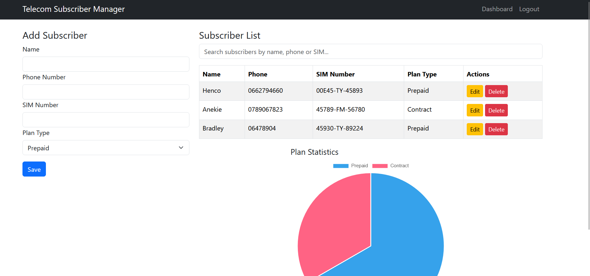
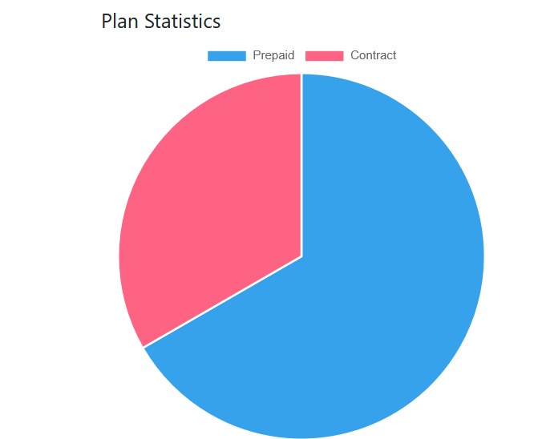
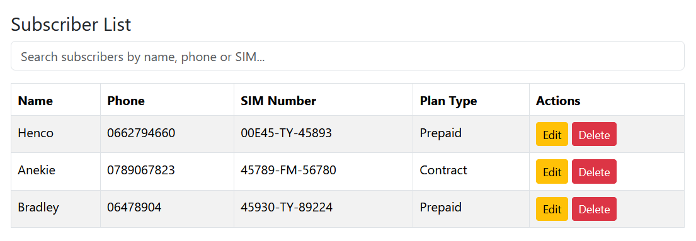

# 📡 MERN Telecom Management System

A **full-stack telecom management application** built with the MERN stack (MongoDB, Express, React, Node.js).  
Designed for managing telecom subscribers, viewing plan statistics.

---

## ✨ Features

- 📋 **Subscriber Management** — Add, edit, delete subscribers.
- 🔍 **Search & Filter** — Find subscribers by name, phone number, or SIM number.
- 📊 **Plan Statistics** — Interactive pie chart (Prepaid vs Contract) using Chart.js.

---

## 🖥️ Tech Stack

**Frontend:**
- React
- React Bootstrap
- React Chart.js 2


**Backend:**
- Node.js
- Express
- MongoDB (Mongoose)
- JWT Authentication

**Deployment:**
- Google Cloud App Engine (backend + frontend)
- MongoDB Atlas (cloud database)

---

## 📂 Project Structure

```
telecom-mern/
  frontend/       # React client
  backend/        # Node.js/Express server
  README.md
  .gitignore
```

---

## 🚀 Getting Started

### 1️⃣ Clone the Repository
```bash
git clone https://github.com/RailwayGunDora/EuphoriaTelecom.git
cd telecom-mern
```

### 2️⃣ Install Dependencies
```bash
# Backend
cd backend
npm install

# Frontend
cd ../frontend
npm install
```

### 3️⃣ Environment Variables
Create a `.env` file inside the `backend/` folder:

```env
MONGODB_URI=your_mongodb_atlas_connection_string
JWT_SECRET=your_jwt_secret
PORT=5000
```

---

### 4️⃣ Run Locally

**Start Backend:**
```bash
cd backend
npm start
```

**Start Frontend:**
```bash
cd ../frontend
npm start
```

The backend will run on `http://localhost:5000` and frontend on `http://localhost:3000`.

---

## 📦 Deployment (Google Cloud App Engine)

1. **Build frontend:**
```bash
cd frontend
npm run build
```

2. **Serve React build from backend** (in `server.js`):
```js
const path = require('path');

app.use(express.static(path.join(__dirname, '../frontend/build')));
app.get('*', (req, res) => {
  res.sendFile(path.resolve(__dirname, '../frontend/build', 'index.html'));
});
```

3. **Create `app.yaml` in backend:**
```yaml
runtime: nodejs20
instance_class: F2
env_variables:
  MONGODB_URI: "your_mongodb_connection_string"
  JWT_SECRET: "your_jwt_secret"
  PORT: 8080
handlers:
  - url: /.*
    script: auto
```

4. **Deploy:**
```bash
cd backend
gcloud app deploy
```


---

## 📸 Screenshots

Example layout:
| Dashboard View | Plan Statistics | Subscriber Management |
| --- | --- | --- |
|  |  |  |

---

## 🛠️ Author

**Dixon**  
[GitHub](https://github.com/RailwayGunDora/) • [LinkedIn](https://www.linkedin.com/in/dickson-thabo-558b4812a/)

---

## 📜 License
This project is licensed under the MIT License.
